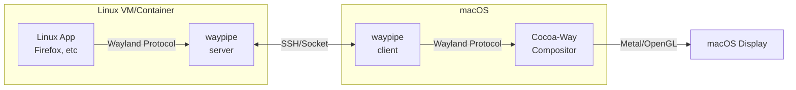

# Cocoa-Way

<div align="center">

[](https://github.com/J-x-Z/cocoa-way/releases)
[](https://github.com/J-x-Z/cocoa-way/actions)
[](https://www.gnu.org/licenses/gpl-3.0)
[](https://www.rust-lang.org/)
[](https://www.apple.com/macos/)

**Native macOS Wayland compositor for running Linux apps seamlessly**

[Demo Video](#-demo-video) • [Install](#-installation) • [Quick Start](#-quick-start) • [Architecture](#-architecture)

</div>

---

## 🎥 Demo Video

[](https://youtu.be/VS3vQp5i8YQ)

> *True protocol portability: Cocoa-Way rendering Linux apps from OrbStack via Unix sockets.*

## ✨ Features

| Feature | Description |
|---------|-------------|
| 🍎 **Native macOS** | Metal/OpenGL rendering, seamless desktop integration |
| 🚀 **Zero VM Overhead** | Direct Wayland protocol via socket, no virtualization |
| 📺 **HiDPI Ready** | Optimized for Retina displays with proper scaling |
| 🎨 **Polished UI** | Server-side decorations with shadows and focus indicators |
| ⚡ **Hardware Accelerated** | Efficient OpenGL rendering pipeline |

## 📦 Installation

### Homebrew (Recommended)

```bash
brew tap J-x-Z/tap
brew install cocoa-way waypipe-darwin
```

### Download Binary

Download the latest `.dmg` or `.zip` from [Releases](https://github.com/J-x-Z/cocoa-way/releases).

### Build from Source

```bash
# Install dependencies
brew install libxkbcommon pixman pkg-config

# Clone and build
git clone https://github.com/J-x-Z/cocoa-way.git
cd cocoa-way
cargo build --release
```

## 🚀 Quick Start

1. **Start the compositor:**
   ```bash
   cocoa-way
   ```

2. **Connect Linux apps via SSH:**
   ```bash
   ./run_waypipe.sh ssh user@linux-host firefox
   ```

## 🏗️ Architecture



## 🆚 Comparison

| Solution | Latency | HiDPI | Native Integration | Setup Complexity |
|----------|---------|-------|--------------------|------------------|
| **Cocoa-Way** | ⚡ Low | ✅ | ✅ Native windows | 🟢 Easy |
| XQuartz | 🐢 High | ⚠️ Partial | ⚠️ X11 quirks | 🟡 Medium |
| VNC | 🐢 High | ❌ | ❌ Full screen | 🟡 Medium |
| VM GUI | 🐢 High | ⚠️ Partial | ❌ Separate window | 🔴 Complex |

## 🗺️ Roadmap

- [x] macOS backend (Metal/OpenGL)
- [x] Waypipe integration
- [x] HiDPI scaling
- [ ] 🚧 Windows backend ([win-way](https://github.com/J-x-Z/win-way))
- [ ] 📱 Android NDK backend (planned)
- [ ] Multi-monitor support
- [ ] Clipboard sync

## 📚 Research

This project is part of the **"Turbo-Charged Protocol Virtualization"** research initiative exploring zero-cost cross-platform Wayland via Rust trait monomorphization + SIMD-accelerated pixel conversion.

## ❓ Troubleshooting

<details>
<summary><b>SSH: "remote port forwarding failed"</b></summary>

A stale socket file exists on the remote host. Our `run_waypipe.sh` script handles this automatically with `-o StreamLocalBindUnlink=yes`.

If running manually:
```bash
waypipe ssh -o StreamLocalBindUnlink=yes user@host ...
```
</details>

## 🤝 Contributing

Contributions welcome! Please open an issue first to discuss major changes.

## 📄 License

[GPL-3.0](LICENSE) - Copyright (c) 2024-2025 J-x-Z
